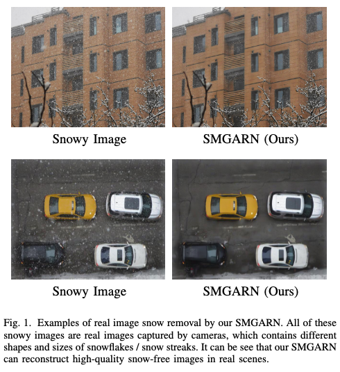
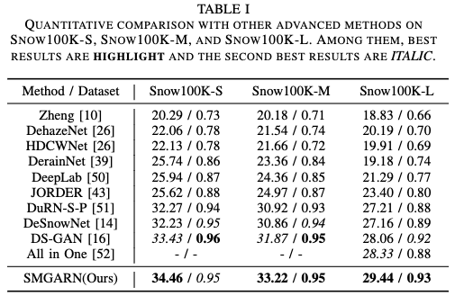
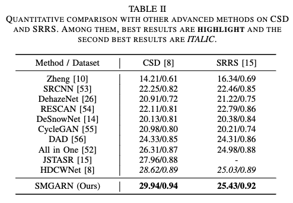
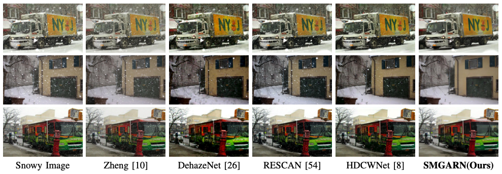

# SMGARN
Snow Mask Guided Adaptive Residual Network for Image Snow Removal
# Snow Mask Guided Adaptive Residual Network for Image Snow Removal (SMGAREN)
This repository is an official PyTorch implementation of the paper ''Snow Mask Guided Adaptive Residual Network for Image Snow Removal''. (TCSVT 2022)

Image restoration under severe weather is a challenging task. 
Most of the past works focused on removing rain and haze phenomena in images. 
However, snow is also an extremely common atmospheric phenomenon that will seriously affect the performance of high-level computer vision tasks, such as object detection and semantic segmentation. 
Recently, some methods have been proposed for snow removing, and most methods deal with snow images directly as the optimization object. However, the distribution of snow location and shape is complex. Therefore, failure to detect snowflakes / snow streak effectively will affect snow removing and limit the model performance. 
To solve these issues, we propose a Snow Mask Guided Adaptive Residual Network (SMGARN). Specifically, SMGARN consists of three parts, Mask-Net, Guidance-Fusion Network (GF-Net), and Reconstruct-Net.
Firstly, we build a Mask-Net with Self-pixel Attention (SA) and Cross-pixel Attention (CA) to capture the features of snowflakes and accurately localized the location of the snow, thus predicting an accurate snow mask. 
Secondly, the predicted snow mask is sent into the specially designed GF-Net to adaptively guide the model to remove snow. Finally, an efficient Reconstruct-Net is used to remove the veiling effect and correct the image to reconstruct the final snow-free image. 
Extensive experiments show that our SMGARN numerically outperforms all existing snow removal methods, and the reconstructed images are clearer in visual contrast. All codes will be available.



##Prerequisites
* Python 3.8
* PyTorch >= 1.7.1
* numpy
* skimage
* **imageio**
* matplotlib
* tqdm

For more informaiton, please refer to <a href="https://github.com/thstkdgus35/EDSR-PyTorch">EDSR</a>.

In order to quickly verify the idea, we directly use the EDSR code, which is originally a code for image super-resolution.

We treat the image snow removal task as a super-resolution task with an upsampling factor of x1. Therefore, when using this code, we set the scale = 1.


## Dataset

We train our model using Snow100K and CSD training sets. Put all clear images into the dataset/DIV2K/DIV2K_train_HR

For snow mask, put the mask data in the dataset into dataset/DIV2K/DIV2K_train_EDGE

As for snowy images, put them into the dataset/DIV2K/DIV2K_train_LR_bicubic/x1


##Training

Using --ext sep_reset argument on your first running. 

You can skip the decoding part and use saved binaries with --reset argument in second time.

```python
## train
python main.py --scale 1 --patch_size 64 --save smgarn --ext sep_reset --save_results
```

##Testing
All pre-trained model should be put into experiment/ first.
```python
## test
python main.py --data_test DIV2K --data_range 1-2000 --scale 1 --pre_train your_path/SMGARN/experiment/model_name/model/model_best.pt --test_only --save_results --ext sep_reset
```
After the above command is run, a file named test will be generated in experiment/, where you can view the snow-removed image.


## Performance

### Results






### All pre-trained model will be provided soon.
